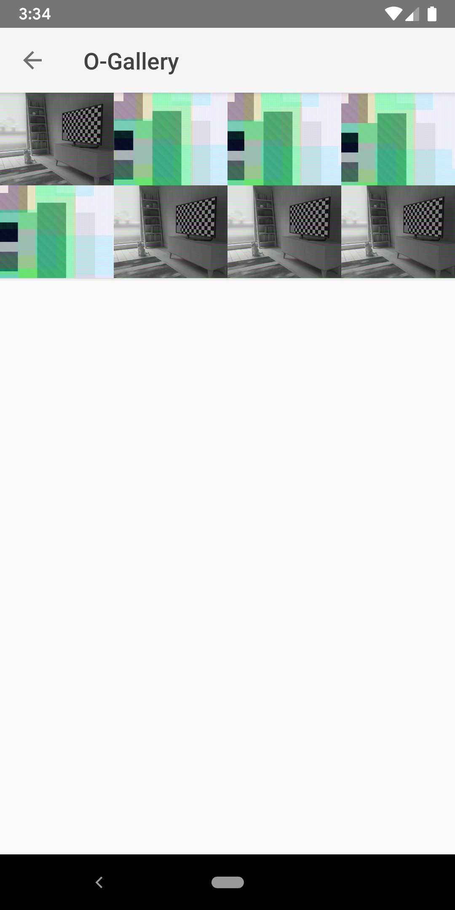

# Kotlin-Gallery

A simple and minimal Gallery in Kotlin. 

Example use of `ContentResolver` queries to fetch all media from external storage or a specific folder.

### Screenshots

##### Landing

##### Browse Folder
